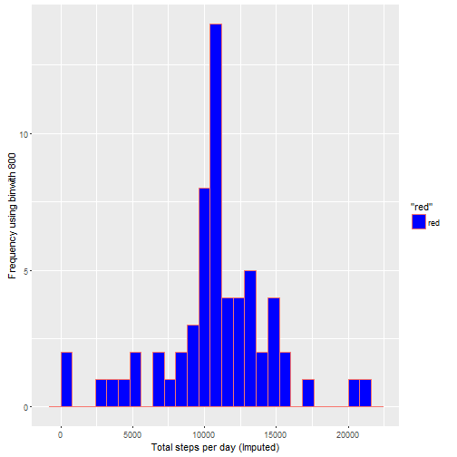

#Reproducible Researche Project 1

This assignment makes use of data from a personal activity monitoring device. This device collects data at 5 minute intervals through out the day. The data consists of two months of data from an anonymous individual collected during the months of October and November, 2012 and include the number of steps taken in 5 minute intervals each day.

## Loading and preprocessing the data

#### Loading Library

```r
source("ipak.R")
library(ggplot2)
```

```
## 
## Attaching package: 'ggplot2'
```

```
## The following object is masked _by_ '.GlobalEnv':
## 
##     diamonds
```

```r
library(scales)
library(plyr)
library(lattice)
library(data.table)
```

```
## data.table 1.9.6  For help type ?data.table or https://github.com/Rdatatable/data.table/wiki
```

```
## The fastest way to learn (by data.table authors): https://www.datacamp.com/courses/data-analysis-the-data-table-way
```

```r
library(httr)
library(Hmisc)
```

```
## Warning: package 'Hmisc' was built under R version 3.2.5
```

```
## Loading required package: survival
```

```
## Loading required package: Formula
```

```
## 
## Attaching package: 'Hmisc'
```

```
## The following objects are masked from 'package:plyr':
## 
##     is.discrete, summarize
```

```
## The following objects are masked from 'package:base':
## 
##     format.pval, round.POSIXt, trunc.POSIXt, units
```

#### Reading in the dataset and/or processing the data

```r
figures <- "figures" 
if(!file.exists(figures)){
  dir.create(figures)
}

if(!file.exists('activity.csv')){
    unzip('activity.zip')
}
w_file <- paste(getwd(), "/activity.csv", sep = "")

activityData <- read.table(file = w_file, header = TRUE, sep = ",")
```

## What is mean total number of steps taken per day?

#### 1. Calculate the total number of steps taken per day and 
#### 2. Make Histogram of the total number of steps taken each day


```r
#transform the data 
activityData$Datetime <- strptime(gsub("([0-9]{1,2})([0-9]{2})", "\\1:\\2", activityData$interval), format='%H:%M')

# Total number of steps taken per day?
stepsDay <- tapply(activityData$steps, activityData$date, sum, na.rm=TRUE)

# Histogram
qplot(stepsDay, geom = "histogram", fill = I("green"), colour = "red", xlab='Total Steps per Day', ylab='Frequency using binwith 800', binwidth=800)
```


#### 3. Mean and median number of steps taken each day


```r
stepsDayMean <- mean(stepsDay)
stepsDayMedian <- median(stepsDay)
```
* Mean: 9354.2295082
* Median:  10395

## What is the average daily activity pattern?

#### Average daily

```r
averageStepsPerTime <- aggregate(x=list(meanSteps=activityData$steps), by=list(interval=activityData$interval), FUN=mean, na.rm=TRUE)
```


#### 1. Make a time series plot

```r
ggplot(data=averageStepsPerTime, aes(x=interval, y=meanSteps)) +
    geom_line(colour="blue") +
    xlab("interval 5-minute ") +
    ylab("average of steps taken") 
```


#### 2. Which 5-minute interval, on average across all the days in the dataset, contains the maximum number of steps?

```r
maxSteps <- which.max(averageStepsPerTime$meanSteps)
timeMaxSteps <-  gsub("([0-9]{1,2})([0-9]{2})", "\\1:\\2", averageStepsPerTime[maxSteps,'interval'])
```

* max steps: 104
* invertal of max steps: 8:35


## Imputing missing values

#### 1. Calculate and report the total number of missing values in the dataset
##### i.e. the total number of rows with NAs

```r
numMissingValues <- length(which(is.na(activityData$steps)))
```

* Number of missing values: 2304


##### 2. Devise a strategy for filling in all of the missing values in the dataset.
##### 3. Create a new dataset that is equal to the original dataset but with the missing data filled in.

```r
activityDataImputed <- activityData
activityDataImputed$steps <- impute(activityData$steps, fun=mean)
```

#### 4. Make a histogram of the total number of steps taken each day 

```r
stepsDayImputed <- tapply(activityDataImputed$steps, activityDataImputed$date, sum)

qplot(stepsDayImputed, geom = "histogram", fill = I("blue"), colour = "red", xlab='Total steps per day (Imputed)', ylab='Frequency using binwith 800', binwidth=800)
```



#### The Mean and Median total number of steps taken per day. 

```r
stepsDayMeanImputed <- mean(stepsDayImputed)
stepsDayMedianImputed <- median(stepsDayImputed)
```
* Mean - Imputed: 1.0766189 &times; 10<sup>4</sup>
* Median - Imputed:  1.0766189 &times; 10<sup>4</sup>


## Are there differences in activity patterns between weekdays and weekends?

#### 1. Create a new factor variable in the dataset with two levels – “weekday” and “weekend” indicating whether a given date is a weekday or weekend day.


```r
activityDataImputed$dateType <-  ifelse(as.POSIXlt(activityDataImputed$date)$wday %in% c(0,6), 'weekend', 'weekday')
```

#### 2. Make a panel plot containing a time series plot


```r
averagedActivityImputed <- aggregate(steps ~ interval + dateType, data=activityDataImputed, mean)

ggplot(averagedActivityImputed, aes(interval, steps)) + 
    geom_line(colour = "cyan") + 
    facet_grid(dateType ~ .) +
    xlab("5-minute interval") + 
    ylab("avarage number of steps")
```


###End
